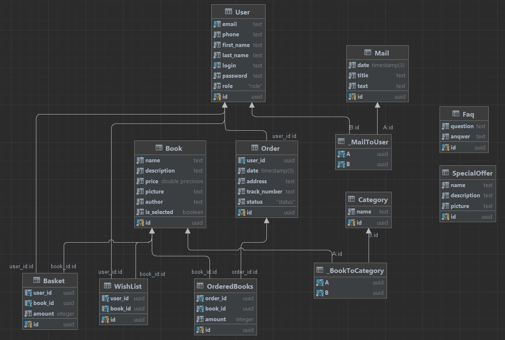

# Кокос
___
**Тема проекта:** книжный интернет-магазин "Кокос"

**Описание:** самый уютный сайт для покупки книг. Заказывайте книги, читайте самые свежие новости из мира литературы, следите за акциями и умиляйетсь с нашего талисмана - кота Кокоса.
___

*Проект выполняет:* Голякова Татьяна М33031

ссылка: https://web-tatia.onrender.com/

---

## Описание базы данных

**User** - пользователь сайта

**Book** - товар, книга

**WishList** - избранное

**Basket** - корзина с товарами

**Category** - содержит книги, принадлежащие к определенной категории

**Faq** - популярные вопросы и ответы на них

**Mail** - уведомления

**SpecialOffer** - акции

**Order** - описание заказа

**OrderedBooks** - книги в заказе